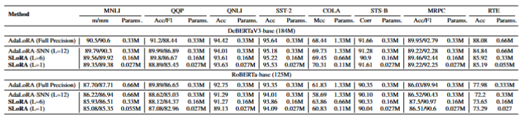
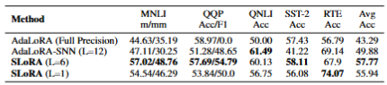

# SLoRA: Spiking Low-Rank Adaptation for Power-Efficient Fine-Tuning

## Requirements
in ./SLoRA
pip install -e.
pip install -r requirements.txt

in ./SLoRA/loralib
pip install -e.

## Datasets
When running the scripts, the GLUE dataset will be downloaded automatically. If an internet connection is unavailable, please download the dataset locally beforehand.

## Models
If using a local model, please modify the model_name_or_path parameter in the scripts.

## Run
in ./SLoRA
run `bash ./scripts/cola.sh` for cola task

## Results
### GLUE benchmark

### AdvGLUE benchmark

## Acknowledgments
Parts of the code are inspired by [AdaLoRA](https://github.com/QingruZhang/AdaLoRA).
